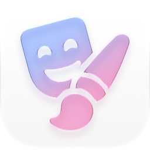

  

# Placard

Placard is an iOS app for browsing, creating, installing, and managing custom PosterBoard wallpapers.

## Features

- Browse, search, sort, and preview community-made interactive wallpapers
- Download or import local `.tendies` wallpaper packages
- Turn a vertical video of up to 12 seconds into a looping or auto-reversing Lock Screen wallpaper
- Install wallpapers directly into PosterBoard on supported physical devices
- View and remove installed custom and featured wallpapers
- Refresh SpringBoard after wallpaper changes with NeoSpring
- English and Simplified Chinese localization

## Preview

  

## Requirements

- Xcode 26 or later
- iOS 26 or later
- A physical device on which `bad_query` is supported for installation and library management

The Simulator can be used to browse the catalog and develop the interface, but it cannot install or manage system wallpapers.

## Building

1. Clone this repository.
2. Open `placard.xcodeproj` in Xcode.
3. Select the **placard** target and choose your own development team under **Signing & Capabilities**.
4. Build and run the app on your device.

Swift Package Manager resolves [ZIPFoundation](https://github.com/weichsel/ZIPFoundation) automatically when the project is opened.

## How it works

Placard fetches the community wallpaper catalog, downloads the selected `.tendies` package, validates and extracts its PosterBoard descriptors, and assigns fresh identifiers before installation. On supported devices, `bad_query` provides access to the PosterBoard container. Placard also uses that access to display and remove installed wallpapers.

For a custom video wallpaper, Placard generates the required CAML and PosterBoard descriptor structure locally, then installs it through the same pipeline. Wallpaper changes finish with a SpringBoard refresh powered by NeoSpring.

> [!WARNING]
> Placard relies on behavior that is not provided by a public Apple API. Compatibility may change between iOS releases. Installing or deleting system wallpaper data carries risk; use the app only on a device and OS version you are prepared to test.

## Acknowledgements

Placard would not exist without the work of the following projects and contributors:

- [Pocket Poster](https://github.com/leminlimez/Pocket-Poster) by LeminLimez, the original project that inspired Placard's PosterBoard wallpaper workflow and `.tendies` support.
- [bad_query](https://github.com/forcequitOS/bad_query) by forcequitOS, which provides the sandbox extension technique used to access PosterBoard data on supported systems.
- [SerStars/nugget-wallpapers](https://github.com/SerStars/nugget-wallpapers) and [CAPlayground/wallpapers](https://github.com/CAPlayground/wallpapers), which provide the wallpaper metadata, previews, and packages shown in Placard.
- [NeoSpring](https://github.com/rooootdev/neospring) by rooootdev and its contributors, whose SpringBoard refresh technique is used after wallpaper changes.
- [ZIPFoundation](https://github.com/weichsel/ZIPFoundation) for ZIP archive handling.

Wallpaper artwork remains the property of its respective creators. Author attribution supplied by the catalog is displayed in the app.

## License

Placard is released under the [GNU General Public License v3.0](LICENSE).

Some incorporated techniques or source material come from upstream projects. Review their respective terms before redistributing a build; in particular, the upstream `bad_query` and NeoSpring repositories may not declare a separate license.
